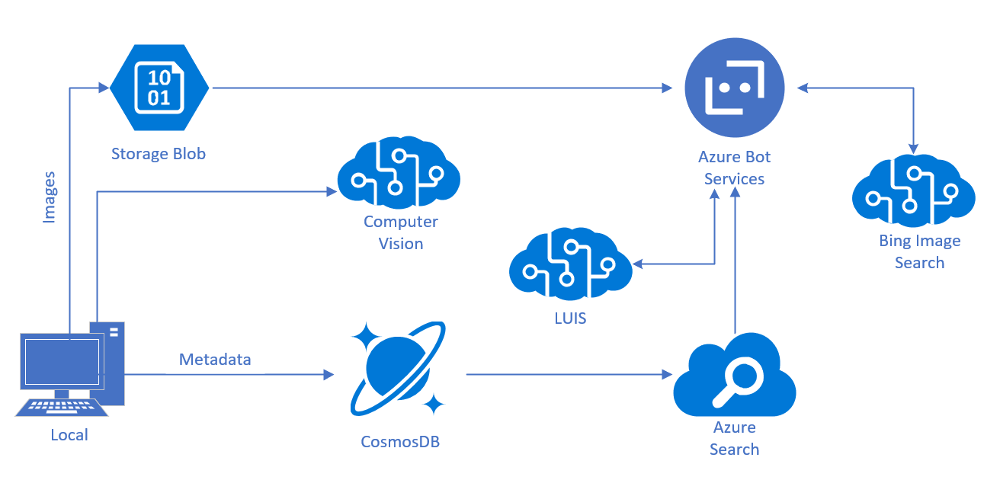

## 1_Overview:
Estimated Time: 10-15 minutes

### Introduction and Motivation

#### Looking back  
In the previous labs, we built an end-to-end scenario that allows you to pull in your own pictures, use Cognitive Services to find objects and people in the images, create a description of the images, and store all of that data into a NoSQL Store (CosmosDB). Then we used that NoSQL Store to populate an Azure Search index, and then build a Bot Framework bot using LUIS to allow easy, targeted querying.

#### What next?  
As you know, once you deploy any application or process, it's never *really* complete. There are always additions. Sometimes development happens in phases. Sometimes the requirements change. Well, a bot is just a type of application, so the same idea applies here.  

Let's say, for the purposes of this scenario, you want to enhance PictureBot. Now, due to the title of this section, you may have already inferred what is coming next. However, take a few minutes to brainstorm with a neighbor what are some ways you might be able to make PictureBot better.  

...  
...  
...  

OK, welcome back! Hopefully you came up with some good ideas for future enhancements. Feel free to try implementing them **later**. If you're looking to do more investigating around designing and architecting intelligent agents (and how to deal with enhancements), we recommend checking out this course: [Intelligent Agents: Design and Architecture](https://aka.ms/daaia).  

So you're probably wondering how we're going to use one of the Bing Search APIs (which are part of Azure Cognitive Services) to make our bot better. You may have noticed that some of your queries result in "There were no results for {insert search request}." You might have even noticed that sometimes, there are search hits, but not exactly what you were searching for. How can we address this to provide the users with a better experience?  

In this lab, we'll try to improve the user experience by giving users the option to also search the web to find images that match their search request after we've returned the results from our Azure Search service. We'll do this by calling the Bing Image Search API from within our bot application. After we've updated our bot, we'll republish it on Azure Bot Service.  

#### Lab options  

Depending on your previous experience and your experience in this workshop, you might (hopefully) be feeling more comfortable and confident with Cognitive Services and the Bot Framework. For this last lab, you have two options:  
1. Continue to the [next page](./2_Bing_Search.md) to receive step-by-step instructions, resources, etc. (just as in previous labs).
2. Do not open the next file. Instead, try integrating Bing Image Search API to your bot without assistance. If you choose this option, you should understand that you **will not receive debugging assistance** from the instructor. You can peek at the solution file (under **resources > code**) or the [next page](./2_Bing_Search.md) for ideas.  

### Continue to [2_Bing_Search](./2_Bing_Search.md)

Return to [0_README](0_README.md)